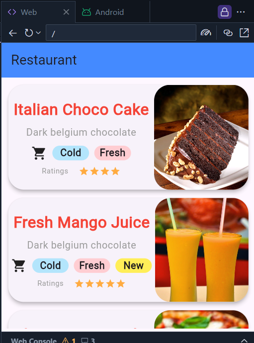
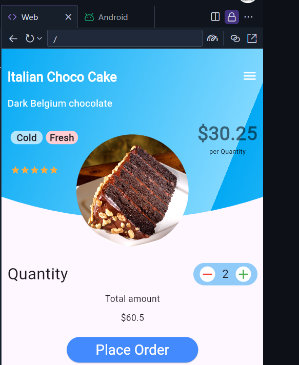

# myapp

A new Flutter project.

Segunda pantalla

## Getting Started
https://github.com/vijayinyoutube/Restaurant.git
This project is a starting point for a Flutter application.
## hola
Part-1 https://youtu.be/3W9N_Chs71s

Part-2 https://youtu.be/JX1zTkURlTo

Visit My Channel for more Flutter Tutorials: https://www.youtube.com/channel/UCBC_Z7jla1GSITcqLKAtPxQ

A few resources to get you started if this is your first Flutter project:

- [Lab: Write your first Flutter app](https://docs.flutter.dev/get-started/codelab)
- [Cookbook: Useful Flutter samples](https://docs.flutter.dev/cookbook)

For help getting started with Flutter development, view the
[online documentation](https://docs.flutter.dev/), which offers tutorials,
samples, guidance on mobile development, and a full API reference.
